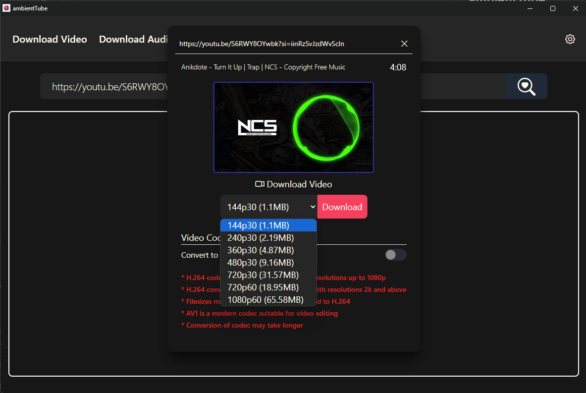
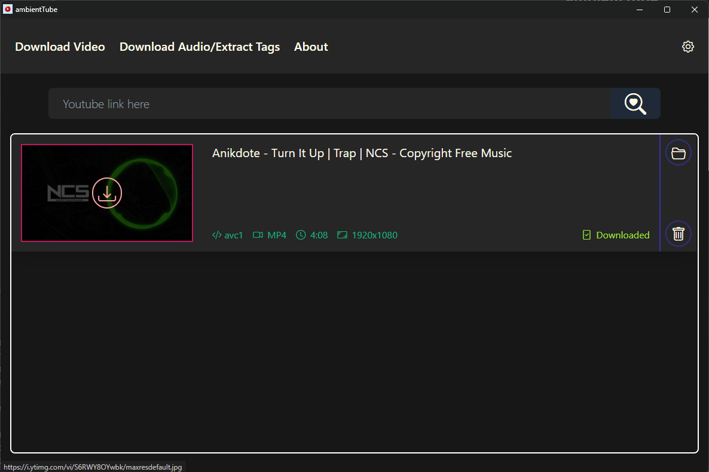
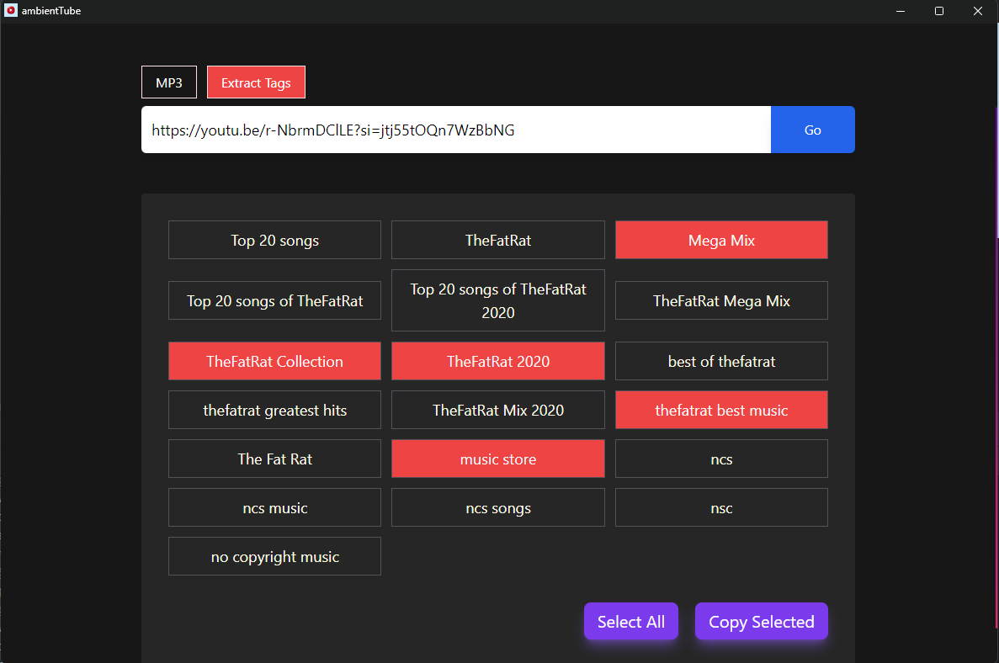
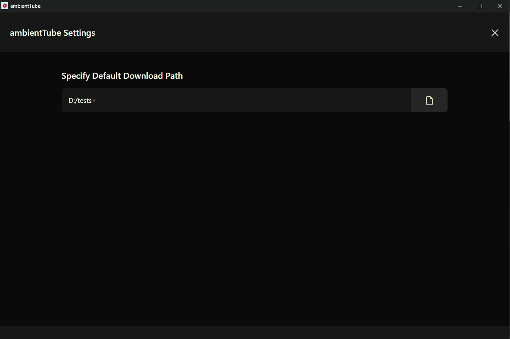
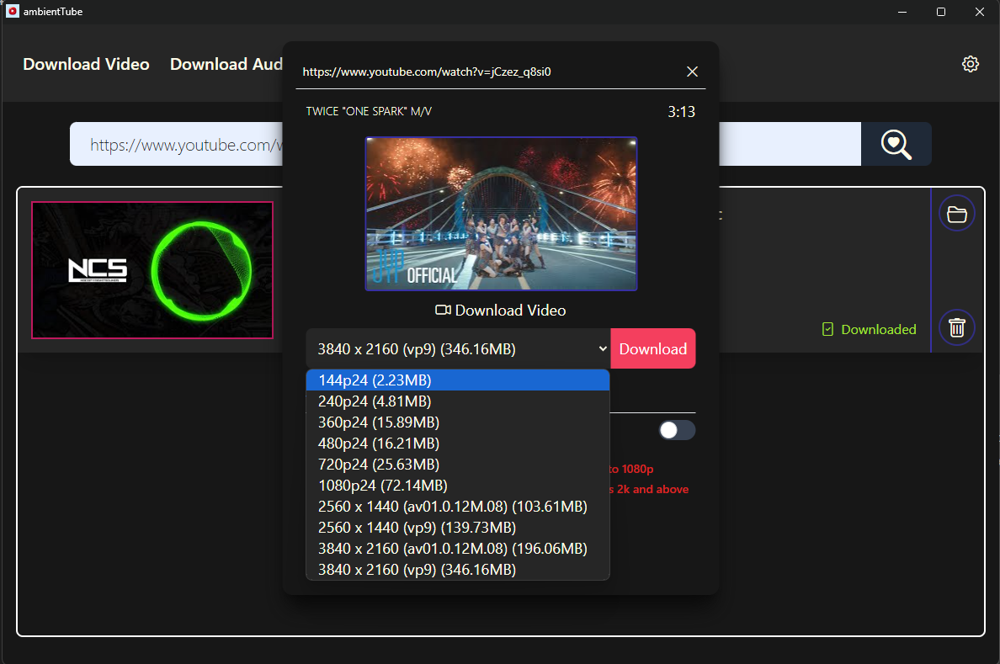
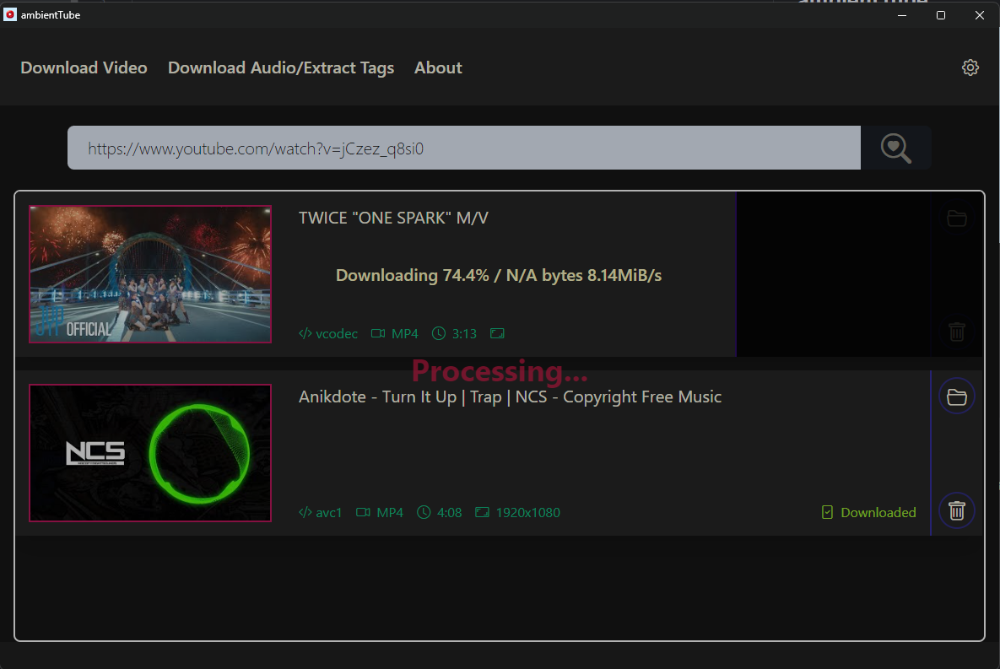

<h1 style="text-align: center">ambientTube</h1>

    

<h2>Features</h2>

<ul class="list-disc space-y-2">
    <li>Download 4k videos in vp90 and av1 codecs. and be able to convert them to H.264</li>
    <li>Supports multiples codecs av01 & vp90(for 2k, 4k) and H.264 for res below 2k</li>
    <li>Supports all resolutions</li>
    <li>Supports conversion of codecs for videos 2k and above to H.264</li>
    <li>Uses NVIDIA Cuda Cores for conversion of 2k, 4k, 8k videos to H.264</li>
    <li>Download Thumbnails</li>
    <li>Download Audio MP3 320kbps</li>
    <li>Extract Tags from youtube video</li>
    <li>Unlimited Downloads</li>
</ul>

## Acknowledgements

<ul class="list-disc space-y-2">
    <li>Python</li>
    <li><a href="https://github.com/python-eel/Eel">eel python library</a> (Electron equivalent library in py)</li>
    <li>Javascript</li>
    <li>Tailwind CSS </li>
    <li><a href="http://icons.getbootstrap.com/">bootstrap icons</a></li>
    <li><a href="https://ffmpeg.org/download.html">FFMPEG</a></li>
    <li><a href="https://github.com/yt-dlp/yt-dlp">yt-dlp</a></li>
    <li>ChatGPT (Helped me in Testing and fixing bugs and generating the app logo)</li>
    <li><a href="https://github.com/sioaeko/Deeptube-Youtube-Downloader">Deeptube-Youtube-Downloader</a> (source code helped me to implement downloading audio and video and how to use FFMPEG in code)</li>
    <li><a href="https://ostechnix.com/yt-dlp-tutorial/">yt-dlp guide</a> (Quick to get started and getting to know the commands)</li>
    <li><a href="https://www.jetbrains.com/pycharm/download/">PyCharm (Best IDE for Python)</a></li>
    <li>PyInstaller for building executable file</li>
    <li><a href="https://www.youtube.com/watch?v=p3tSLatmGvU">Tutorial for converting .py to .exe</a></li>
</ul>

### supports multiple video codecs. vp9(google's codec) and av01(newer codec) for 2k and above res

# Note 

[//]: # (
My code may break as it is not tested rigorously
)

i'll work on this project and implement more features in the future

#### Features that i want to implement
<ul>
    <li>Downloading multiple videos at the same time</li>
    <li>Improving UI</li>
    <li>Implementing software based H.264 codec conversion (now it supports only for NVIDIA GPUs') for 4k videos</li>
</ul>

